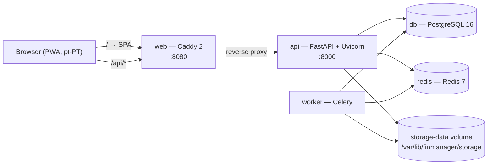

# Architecture

## Container map



The `storage-data` volume is the one piece of state shared between containers
that run as different users: `api` and `worker` serve as `finmanager` (uid
10001), while one-shot commands (`./fm seed`, `./fm check`) and the dev overlay
run as root against the bind-mounted source. Both are in the `finmanager` group
and the tree is setgid and group-writable, so neither can lock the other out —
see [ADR-0024](decisions/0024-attachment-storage-is-group-owned.md). The API
container starts as root only long enough to reconcile that volume, then drops
privileges before `alembic` or `uvicorn` run.

In production the `web` image is a multi-stage build whose final stage **is** Caddy:
it serves the hashed static bundle and proxies `/api/*` to `api:8000`. Only port
8080 is published. In development (`make dev`) `web` runs the Vite dev server
instead, which proxies `/api` to `api:8000` itself — the browser origin never
changes, so cookies behave identically in both modes.

`worker` is provisioned in Phase 0 even though **M9 queued no jobs by design**.
M1 is the first module to use it in spirit: every parse writes a `ProcessingJob`
row (`job_type="supermarket.parse"`), which backs the parsing queue view and lets a
`FAILED` receipt retry without a re-upload. The parse itself, however, still runs
**inline in the request** (`supermarket.service.parse_receipt`) — the job row exists
for observability and retry today, not for asynchronous execution. Moving it
onto Celery is a follow-up, not something already in place.

## Request flow

1. The browser sends a cookie-authenticated request to `/api/...`.
2. `RateLimitMiddleware` applies a fixed-window Redis counter to login, password
   change, uploads and provider lookups. It **fails open** — the limiter must never
   be able to take the application down.
3. `SecurityHeadersMiddleware` sets `X-Content-Type-Options`, `X-Frame-Options` and
   `Referrer-Policy`.
4. `get_auth` resolves the session (Redis read-through cache, `sessions` row is
   authoritative), verifies the double-submit CSRF token on unsafe methods, loads
   the user and their `HouseholdMember.role`, and builds an `AuthContext`.
5. The route body runs in a **synchronous** function, so FastAPI executes it in a
   worker thread with a plain (non-async) SQLAlchemy session. One transaction per
   request: `get_db` commits on success and rolls back on any exception.
6. Services own the business rules; routers only translate HTTP to service calls.

### Layering

```
app/api/routers/  HTTP surface — no business logic
app/services/     business rules, guards, derived values, audit writes
app/models/       SQLAlchemy 2.0 declarative models
app/schemas/      Pydantic v2 request/response contracts
app/core/         config, db, security, money, ids, audit, errors, rate limiting
```

## Authentication, sessions and CSRF (M7 FR-7.8)

- Login verifies an **Argon2id** password hash and creates a `sessions` row holding
  a SHA-256 hash of the cookie token — the raw token exists only in the client's
  cookie.
- The cookie is `httpOnly`, `SameSite=Lax`, `Secure` when `COOKIE_SECURE=true`, and
  lives for `SESSION_TTL_DAYS` (30) with a sliding refresh that writes at most once a
  day.
- Every state-changing request must echo the session's CSRF token in
  `X-CSRF-Token` (double-submit). The token is **rotated on every entity switch**.
- Logout, password change and member departure revoke sessions in both Postgres and
  Redis.
- Redis holds a read-through copy of the session so the hot path avoids Postgres;
  the row remains the source of truth.

## RBAC and the entity dimension (M7 FR-7.1 / FR-7.3)

Entity is an **attribution and filter** dimension, never a security boundary. Every
authenticated household member reads every entity's data — this is a four-person
household that already shares a bank account. Roles differ only in write power:

| Role | Read | Write | Manage members & entities |
|---|---|---|---|
| `OWNER` | ✅ | ✅ | ✅ |
| `MEMBER` | ✅ | ✅ | — |
| `VIEWER` | ✅ | — | — |

There is exactly one enforcement point per capability: `require_write` and
`require_owner` in `app/api/deps.py`. Writes additionally pass through
`resolve_write_entity`, which **refuses to guess** an owner when the selector is on
«todas» — the UI answers that by asking for the entity in the create dialog.

## Frontend architecture

Two architectural pillars, plus one shared component that arrived with M9:

1. **Entity selector** (`components/entity-selector.tsx`) — persisted server-side in
   `Session.entity_id`, mirrored into the session context, and part of every
   TanStack Query key so switching perspective invalidates exactly the right caches.
2. **Review Queue** (`routes/review.tsx`) — one generic component driven by
   `{subject_type, subject_id, module, confidence, suggested_payload,
   decision_reasons}` with Confirm / Fix / Dismiss. M9 produces no tasks by design;
   the shell is here so ingestion modules plug in without a bespoke screen.
3. **Transaction picker** (`components/transaction-picker.tsx`) — specified in M9
   UX-9.7 but owned by the shared layer; M1/M3/M4/M5 will reuse it verbatim.

Filter state lives in **URL search params** (`lib/filters.ts`), which makes every
view bookmarkable and feeds the query keys directly. Money and dates are formatted
in exactly one place (`lib/format.ts`) and amounts travel from the API as decimal
strings so they are never parsed into a float before display.

## Storage and attachments

`Document` rows are content-addressed by SHA-256 and fanned out by hash prefix under
`STORAGE_ROOT` (a Docker volume, outside any web root). Uploads and remote images
share one code path: validate magic bytes → reject anything outside the allow-list →
write once → deduplicate on hash. Remote images are downloaded **once**; the source
URL is kept purely as provenance and is never fetched at render time.

Delivery is through `/api/documents/{id}/content?expires=…&signature=…`. The HMAC
signature *is* the authorisation, because `` cannot send a CSRF header; the
link expires in 15 minutes and grants access to exactly one document.

## The ingestion pipeline (M1)

M1a's parse runs in a fixed stage order, each stage a discrete function so a
quality change is always traceable to the stage that caused it. Text comes off
the document first because merchant detection needs something to read; from
there, **merchant detection precedes field extraction, because it is what selects
the parser**:

```mermaid
flowchart LR
  read["Read text\n(word boxes)"]
  detect["Detect merchant\n(NIF / alias / fuzzy name)"]
  profile["Select MerchantParserProfile\n(or generic)"]
  extract["Extract fields\n(per-merchant parser)"]
  normalize["Normalize\n(description_norm, units, pack weight)"]
  resolve["Resolve product\n(CatalogueResolver)"]
  classify["Classify category\n(VocabularyClassifier)"]
  reconcile["Reconcile arithmetic\n(vs printed total)"]
  score["Score confidence"]

  read --> detect --> profile --> extract --> normalize --> resolve --> classify --> reconcile --> score
```



Two stages sit behind a `Protocol` seam today; the rest are plain functions with
no remote alternative planned:

| Stage | Protocol | Local engine (ships enabled) | Remote alternative |
| :--- | :--- | :--- | :--- |
| Extract — digital PDF | `ExtractionProvider` | `pdfplumber` word boxes | Hosted OCR/LLM extraction, once configured |
| Extract — photograph/scan | `OcrProvider` | `pytesseract` | Hosted OCR, once configured |
| Resolve product | `ProductResolver` | `CatalogueResolver` — alias-exact → fuzzy ≥ 0.78 (review band 0.70–0.78) | External product database |
| Classify category | `CategoryClassifier` | `VocabularyClassifier` — local pt-PT L3 vocabulary, fed by description and `merchant_section` | Remote classifier via `register_classifier()` |
| Parser selection | registry, no seam | per-merchant classes + `generic_v1` | — layout parsing stays local |

**Local ships enabled and works with no network and no subscription.** A remote
engine is a per-stage `Setting`; enabling one requires a credential, and without
one the stage silently stays local rather than failing — the same posture as
Brickset in M9. `Resolve product` is no longer a seam-only placeholder: M1a
registered nothing behind it, but M1b registers `CatalogueResolver` as the
default `_product_resolver`, and `register_product_resolver(None)` still
disables the stage entirely for a pipeline run that should skip it.

Extraction works from **word boxes** (`x0`, `x1`, `top`, `bottom` per word,
clustered into lines by vertical proximity) rather than flat text, because the
differences between merchants are positional: Continente prints the IVA class
token first, Lidl prints it last, Piquete prints quantity first. A parser built
on split flat text breaks the moment the extractor's spacing changes; one built
on positions reads the column that is actually there.

The confidence engine (`app/services/supermarket/confidence.py`) is deliberately
**pure** — no clock, no randomness, no I/O — so identical input yields
byte-identical output across runs. It returns `(status, confidence,
decision_reasons)`: a signal of `None` means a stage did not run and has its
weight redistributed over the ones that did; a signal of `0` means a stage ran
and found nothing, which is scored as a genuine failure (see
[ADR-0018](decisions/0018-a-stage-that-did-not-run-is-not-a-stage-that-failed.md)).

### The taxonomy shape (M1b)

`MasterProduct.category_id` is the **deepest assigned** category, at any level
— not always L3, because the household's own sheet leaves L3 blank on
roughly half its rows. The `category_l1_id` / `category_l2_id` /
`category_l3_id` trio is maintained alongside it, recomputed on reparent and
merge, so "spend by L2" stays a single-table group-by with no recursive walk
of `parent_id`. See
[ADR-0020](decisions/0020-deepest-assigned-category-plus-maintained-ancestors.md)
for why a snapshot-per-row or derive-on-read shape was rejected.

### Money over time (M1c)

`product_price_history` is an **append-only** observation log, not a mutable
"current price" per product/merchant. A row is frozen at the moment a receipt
reaches a decided state during parsing, and again on confirm, so a correction
made during review appends a fresh observation rather than rewriting the one
it superseded. €/kg is never stored: price and weight sit on the same row, so
the quotient is derived at read time and cannot drift from its own inputs.
Shrinkflation is the same posture — computed over the trailing 12 months at
query time, never frozen onto a row that cannot know its own future (see
[ADR-0022](decisions/0022-price-history-is-append-only-and-stores-no-quotient.md)).

Every observation carries two measures, identical on every non-Fs row:

| Column | Answers | On an Fs row |
| :--- | :--- | :--- |
| `paid_price_eur` | "What did I spend?" | `0.00` — an Fs article costs nothing |
| `notional_value_eur`* | "What was it worth?" | the catalogue/PVP value, never `0.00` |

*`notional_value_eur` is the same figure written into both `list_price_eur` and
`paid_price_eur` on the observation row, not a separate column — see
[ADR-0023](decisions/0023-fs-observations-carry-the-notional-value-in-both-price-columns.md).
`is_fs` also lives on the row, so the `fs` filter (`all`/`only`/`exclude`) used
across the price, spend and loyalty endpoints never has to join back to
`supermarket_receipt_items` to know which rows to include.

`category_spend()` outer-joins `MasterProduct` rather than inner-joining it, so
a line that has not resolved to a product yet still counts towards spend,
grouped under «Sem categoria», instead of silently vanishing from the total.

The receipt↔transaction reconciliation (FR-1.14) is shipped as a contract, not
a working link: `LedgerProvider` is a `Protocol` with one method,
`candidates()`, and `AbsentLedger` — the default — always answers with none.
`propose_link()` and the manual `link_manually()`/`unlink()` pair already
write and remove `Link(RECEIPT_TRANSACTION)` rows; only `register_provider()`
needs to be called with a real ledger once M2 exists. The same
ship-the-contract-defer-the-implementation posture as
[ADR-0005](decisions/0005-defer-transaction-fk.md).

## Configuration

All configuration arrives from the environment (`app/core/config.py`). Operational
knobs that a user should be able to change without a redeploy — confidence
thresholds, provider opt-ins, the LEGO stale-value threshold, the Brickset API key —
live in the `settings` table and are exposed through `/api/settings`. Credentials
are never echoed back to the browser; the API returns only whether one is set.
