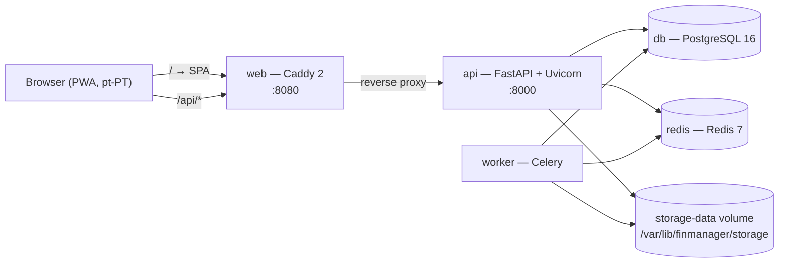

# Architecture

## Container map



In production the `web` image is a multi-stage build whose final stage **is** Caddy:
it serves the hashed static bundle and proxies `/api/*` to `api:8000`. Only port
8080 is published. In development (`make dev`) `web` runs the Vite dev server
instead, which proxies `/api` to `api:8000` itself — the browser origin never
changes, so cookies behave identically in both modes.

`worker` is provisioned in Phase 0 even though **M9 queues no jobs by design**. It
already carries the `ProcessingJob` idempotency contract, so the ingestion-heavy
modules land on a runtime that has been running since day one.

## Request flow

1. The browser sends a cookie-authenticated request to `/api/...`.
2. `RateLimitMiddleware` applies a fixed-window Redis counter to login, password
   change, uploads and provider lookups. It **fails open** — the limiter must never
   be able to take the application down.
3. `SecurityHeadersMiddleware` sets `X-Content-Type-Options`, `X-Frame-Options` and
   `Referrer-Policy`.
4. `get_auth` resolves the session (Redis read-through cache, `sessions` row is
   authoritative), verifies the double-submit CSRF token on unsafe methods, loads
   the user and their `HouseholdMember.role`, and builds an `AuthContext`.
5. The route body runs in a **synchronous** function, so FastAPI executes it in a
   worker thread with a plain (non-async) SQLAlchemy session. One transaction per
   request: `get_db` commits on success and rolls back on any exception.
6. Services own the business rules; routers only translate HTTP to service calls.

### Layering

```
app/api/routers/  HTTP surface — no business logic
app/services/     business rules, guards, derived values, audit writes
app/models/       SQLAlchemy 2.0 declarative models
app/schemas/      Pydantic v2 request/response contracts
app/core/         config, db, security, money, ids, audit, errors, rate limiting
```

## Authentication, sessions and CSRF (M7 FR-7.8)

- Login verifies an **Argon2id** password hash and creates a `sessions` row holding
  a SHA-256 hash of the cookie token — the raw token exists only in the client's
  cookie.
- The cookie is `httpOnly`, `SameSite=Lax`, `Secure` when `COOKIE_SECURE=true`, and
  lives for `SESSION_TTL_DAYS` (30) with a sliding refresh that writes at most once a
  day.
- Every state-changing request must echo the session's CSRF token in
  `X-CSRF-Token` (double-submit). The token is **rotated on every entity switch**.
- Logout, password change and member departure revoke sessions in both Postgres and
  Redis.
- Redis holds a read-through copy of the session so the hot path avoids Postgres;
  the row remains the source of truth.

## RBAC and the entity dimension (M7 FR-7.1 / FR-7.3)

Entity is an **attribution and filter** dimension, never a security boundary. Every
authenticated household member reads every entity's data — this is a four-person
household that already shares a bank account. Roles differ only in write power:

| Role | Read | Write | Manage members & entities |
|---|---|---|---|
| `OWNER` | ✅ | ✅ | ✅ |
| `MEMBER` | ✅ | ✅ | — |
| `VIEWER` | ✅ | — | — |

There is exactly one enforcement point per capability: `require_write` and
`require_owner` in `app/api/deps.py`. Writes additionally pass through
`resolve_write_entity`, which **refuses to guess** an owner when the selector is on
«todas» — the UI answers that by asking for the entity in the create dialog.

## Frontend architecture

Two architectural pillars, plus one shared component that arrived with M9:

1. **Entity selector** (`components/entity-selector.tsx`) — persisted server-side in
   `Session.entity_id`, mirrored into the session context, and part of every
   TanStack Query key so switching perspective invalidates exactly the right caches.
2. **Review Queue** (`routes/review.tsx`) — one generic component driven by
   `{subject_type, subject_id, module, confidence, suggested_payload,
   decision_reasons}` with Confirm / Fix / Dismiss. M9 produces no tasks by design;
   the shell is here so ingestion modules plug in without a bespoke screen.
3. **Transaction picker** (`components/transaction-picker.tsx`) — specified in M9
   UX-9.7 but owned by the shared layer; M1/M3/M4/M5 will reuse it verbatim.

Filter state lives in **URL search params** (`lib/filters.ts`), which makes every
view bookmarkable and feeds the query keys directly. Money and dates are formatted
in exactly one place (`lib/format.ts`) and amounts travel from the API as decimal
strings so they are never parsed into a float before display.

## Storage and attachments

`Document` rows are content-addressed by SHA-256 and fanned out by hash prefix under
`STORAGE_ROOT` (a Docker volume, outside any web root). Uploads and remote images
share one code path: validate magic bytes → reject anything outside the allow-list →
write once → deduplicate on hash. Remote images are downloaded **once**; the source
URL is kept purely as provenance and is never fetched at render time.

Delivery is through `/api/documents/{id}/content?expires=…&signature=…`. The HMAC
signature *is* the authorisation, because `` cannot send a CSRF header; the
link expires in 15 minutes and grants access to exactly one document.

## Configuration

All configuration arrives from the environment (`app/core/config.py`). Operational
knobs that a user should be able to change without a redeploy — confidence
thresholds, provider opt-ins, the LEGO stale-value threshold, the Brickset API key —
live in the `settings` table and are exposed through `/api/settings`. Credentials
are never echoed back to the browser; the API returns only whether one is set.
